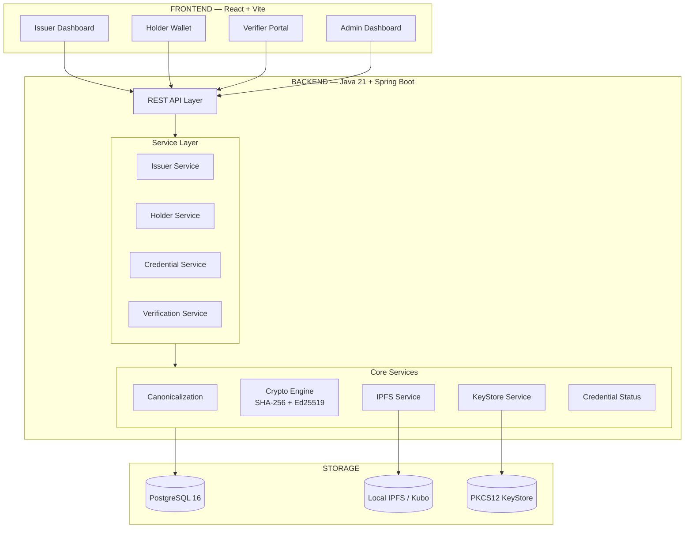

# SSD-CVE — Section 1: System Overview

## Purpose
A decentralized engine for issuing, storing, and verifying digital certificates using Self-Sovereign Identity (SSI) principles. Three roles: **Issuer** (institution), **Holder** (student), **Verifier** (employer/organization).

## Architecture

## Locked Decisions

| Decision | Value |
|----------|-------|
| Hash | SHA-256 |
| Signature | Ed25519 |
| Credential representation | Canonical JSON (deterministic) |
| Document storage | Local IPFS (content-addressed) |
| Metadata | PostgreSQL 16 |
| Private keys | Java KeyStore API + PKCS12 |
| Blockchain | None in MVP |
| Platform | Web only |
| Cost | ₹0 |

## IPFS Accuracy
- **Local IPFS** provides content-addressed storage and local retrieval.
- **CID = content addressing**; **SHA-256 + Ed25519 = cryptographic integrity/authenticity**.
- Decentralized availability requires **multiple IPFS nodes** (future work, not MVP).
- IPFS upload is **not** part of the PostgreSQL transaction; orphaned IPFS objects handled on DB failure.
