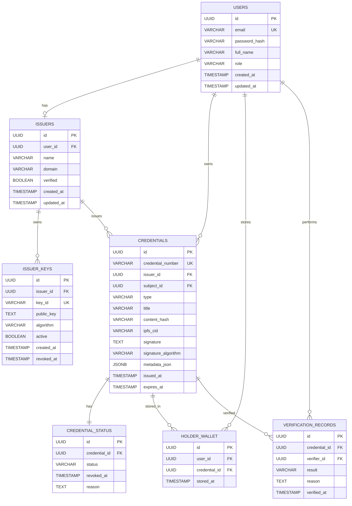

# SSD-CVE — Section 2: Data Model

## Entity Relationship



## PostgreSQL Schema

```sql
CREATE TABLE users (
    id              UUID PRIMARY KEY DEFAULT gen_random_uuid(),
    email           VARCHAR(255) UNIQUE NOT NULL,
    password_hash   VARCHAR(255) NOT NULL,
    full_name       VARCHAR(255) NOT NULL,
    role            VARCHAR(20) NOT NULL CHECK (role IN ('ISSUER','HOLDER','VERIFIER','ADMIN')),
    created_at      TIMESTAMP DEFAULT NOW(),
    updated_at      TIMESTAMP DEFAULT NOW()
);

CREATE TABLE issuers (
    id              UUID PRIMARY KEY DEFAULT gen_random_uuid(),
    user_id         UUID REFERENCES users(id),
    name            VARCHAR(255) NOT NULL,
    domain          VARCHAR(255) NOT NULL,
    public_key      TEXT NOT NULL,
    verified        BOOLEAN DEFAULT FALSE,
    created_at      TIMESTAMP DEFAULT NOW(),
    updated_at      TIMESTAMP DEFAULT NOW()
);

CREATE TABLE issuer_keys (
    id              UUID PRIMARY KEY DEFAULT gen_random_uuid(),
    issuer_id       UUID REFERENCES issuers(id),
    key_id          VARCHAR(100) NOT NULL,
    public_key      TEXT NOT NULL,
    active          BOOLEAN DEFAULT TRUE,
    created_at      TIMESTAMP DEFAULT NOW(),
    UNIQUE(issuer_id, key_id)
);

CREATE TABLE credentials (
    id                  UUID PRIMARY KEY DEFAULT gen_random_uuid(),
    credential_number   VARCHAR(100) UNIQUE NOT NULL,
    issuer_id           UUID REFERENCES issuers(id),
    subject_id          UUID REFERENCES users(id),
    type                VARCHAR(100) NOT NULL,
    title               VARCHAR(255) NOT NULL,
    content_hash        VARCHAR(64) NOT NULL,
    ipfs_cid            VARCHAR(255) NOT NULL,
    signature           TEXT NOT NULL,
    signature_algorithm VARCHAR(50) NOT NULL DEFAULT 'Ed25519',
    key_id              VARCHAR(100) NOT NULL,
    metadata_json       JSONB,
    issued_at           TIMESTAMP DEFAULT NOW(),
    expires_at          TIMESTAMP,
    created_at          TIMESTAMP DEFAULT NOW(),
    updated_at          TIMESTAMP DEFAULT NOW()
);

CREATE TABLE credential_status (
    id              UUID PRIMARY KEY DEFAULT gen_random_uuid(),
    credential_id   UUID REFERENCES credentials(id) UNIQUE,
    status          VARCHAR(20) DEFAULT 'ACTIVE' CHECK (status IN ('ACTIVE','REVOKED')),
    revoked_at      TIMESTAMP,
    reason          TEXT
);

CREATE TABLE holder_wallet (
    id              UUID PRIMARY KEY DEFAULT gen_random_uuid(),
    user_id         UUID REFERENCES users(id),
    credential_id   UUID REFERENCES credentials(id),
    stored_at       TIMESTAMP DEFAULT NOW(),
    UNIQUE(user_id, credential_id)
);

CREATE TABLE verification_records (
    id              UUID PRIMARY KEY DEFAULT gen_random_uuid(),
    credential_id   UUID REFERENCES credentials(id),
    verifier_id     UUID REFERENCES users(id),
    result          VARCHAR(20) NOT NULL CHECK (result IN ('VALID','TAMPERED','REVOKED','EXPIRED','NOT_FOUND','UNAVAILABLE')),
    reason          TEXT,
    verified_at     TIMESTAMP DEFAULT NOW()
);
```

## Key Notes
- `EXPIRED` is **derived** from `expires_at.isBefore(now())`, not stored.
- `credential_number` is the public-facing identifier (e.g., `SSD-CVE-2026-8F42A1`); internal `id` is UUID.
- Private signing keys **never** stored in PostgreSQL — only in PKCS12 KeyStore.
- `issuer_keys` supports key rotation: `issuer → keyId → public key`.
