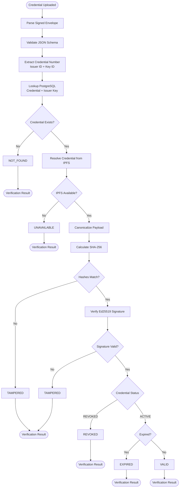
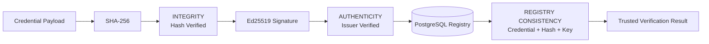
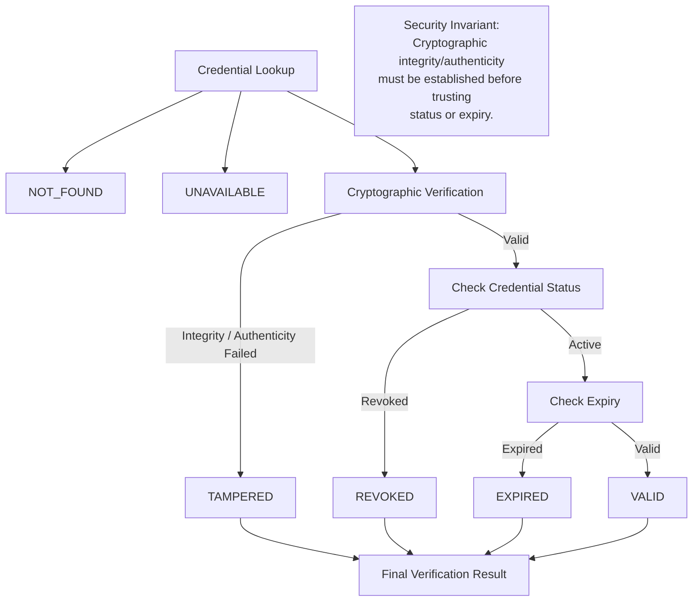

# SSD-CVE — Section 4: Verification Engine

## Flow



## Three-Check Security Story

1. **Integrity:** payload → SHA-256 → envelope hash (detects modification)
2. **Registry consistency:** hash vs PostgreSQL (detects mismatch with registered credential)
3. **Authenticity:** contentHash → Ed25519 → issuer public key (proves issuer signed it)



## Failure Precedence (dependency flow)



**Invariant:** Cryptographic integrity/authenticity must be established **before** trusting credential status or expiry. `revokedAndTampered → TAMPERED`, `expiredAndTampered → TAMPERED`.

## VerificationStatus Enum

```java
public enum VerificationStatus {
    VALID, TAMPERED, REVOKED, EXPIRED, NOT_FOUND, UNAVAILABLE
}
```

Used consistently across controller, service, API response, and `verification_records.result`.

## Verification Independence

Verification depends only on **PostgreSQL + local IPFS** — **never** on the issuer being online. This is a key architectural differentiator.

## Decision Matrix

| Check | Pass | Fail |
|-------|------|------|
| Credential exists in DB | Continue | `NOT_FOUND` |
| IPFS CID resolves | Continue | `UNAVAILABLE` |
| Recomputed hash == envelope hash | Continue | `TAMPERED` |
| Recomputed hash == DB hash | Continue | `TAMPERED` |
| Ed25519 signature valid | Continue | `TAMPERED` |
| Status == ACTIVE | Continue | `REVOKED` |
| `expires_at` future/null | Continue | `EXPIRED` |
| **All pass** | **`VALID`** | — |
