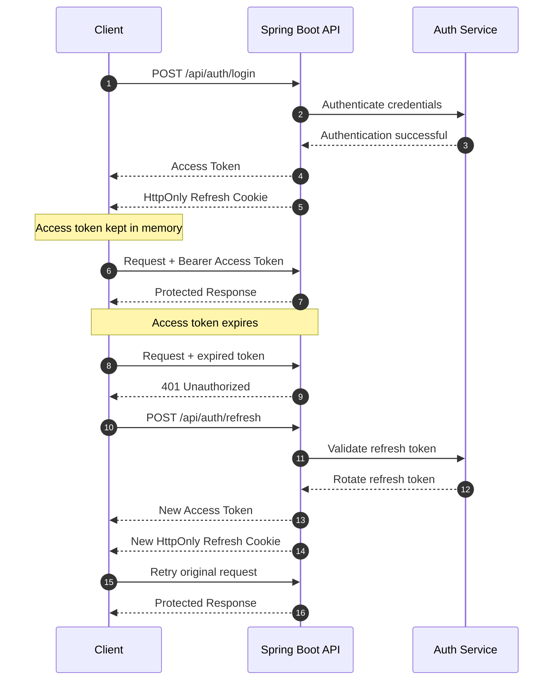
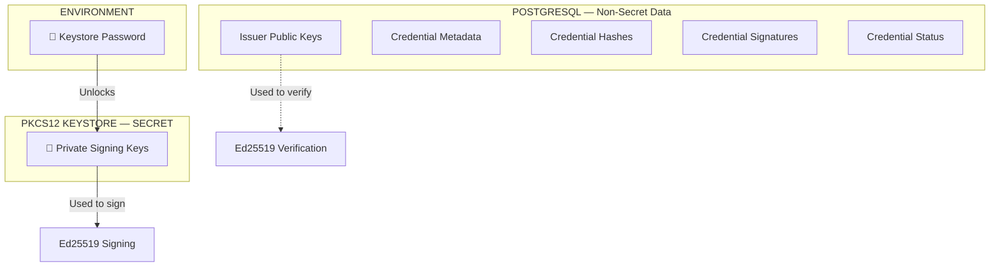
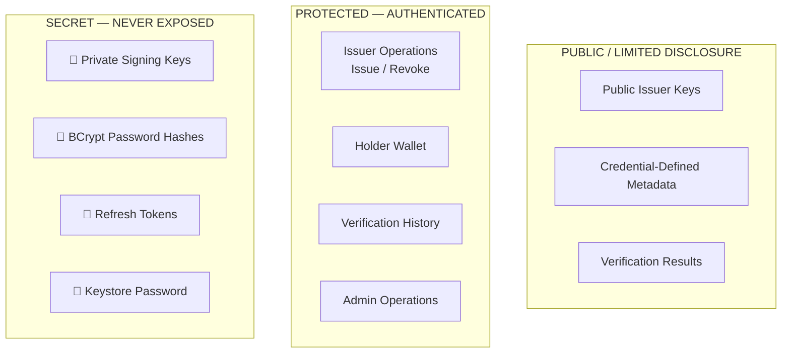

# SSD-CVE — Section 5: Security & Authentication

## JWT + Refresh Cookie

- **Access token:** short-lived (15 min), held in memory
- **Refresh token:** long-lived (7 days), **HttpOnly + Secure + SameSite cookie** (never localStorage), server-side revocable
- Client-side role = **UI routing only**; backend Spring Security is authoritative



## RBAC

| Endpoint Group | ISSUER | HOLDER | VERIFIER | ADMIN |
|----------------|:------:|:------:|:--------:|:-----:|
| `/api/auth/*` | ✅ | ✅ | ✅ | ✅ |
| `/api/issuer/*` | ✅ | ❌ | ❌ | ✅ |
| `/api/holder/*` | ❌ | ✅ | ❌ | ✅ |
| `/api/verifier/verify` | ✅ | ✅ | ✅ | ✅ |
| `/api/admin/*` | ❌ | ❌ | ❌ | ✅ |

## Key Protection

- Private keys in PKCS12 KeyStore, password from env var, never in git
- Public keys in PostgreSQL (`issuers`, `issuer_keys`)
- Key rotation via `keyId` resolution: `issuer → keyId → public key`



## Issuer Authorization

- Only **verified** issuers can issue
- Issuer can only revoke **own** credentials (ownership check, not URL `{id}` trust)

## Verification Independence

- Verification depends only on **PostgreSQL + local IPFS** — **never** on the issuer being online.

## API Security Measures

| Measure | Implementation |
|---------|---------------|
| CORS | Restrict to frontend origin |
| Rate limiting | Per-user/IP on auth + verify endpoints |
| Input validation | Bean Validation (`@Valid`, `@NotBlank`, etc.) |
| SQL injection | JPA/parameterized queries (no string concat) |
| XSS | React escapes by default; CSP headers |
| CSRF | Disabled (stateless JWT), but CORS locked down |
| HTTPS | TLS in production (self-signed for local dev) |
| Secrets | Env vars / `.env`, never in git |

## Security Boundary

```
┌──────────────────────────────────────────────┐
│              PUBLIC (exposed)                │
│  - Public keys                               │
│  - Credential metadata (non-sensitive)       │
│  - Verification results                      │
├──────────────────────────────────────────────┤
│              PROTECTED (auth required)       │
│  - Issuer operations (issue/revoke)          │
│  - Holder wallet                             │
│  - Verification records                      │
├──────────────────────────────────────────────┤
│              SECRET (never exposed)          │
│  - Private signing keys (PKCS12)             │
│  - Password hashes (BCrypt)                  │
│  - Refresh tokens (DB)                       │
│  - Keystore password (env)                   │
└──────────────────────────────────────────────┘
```

