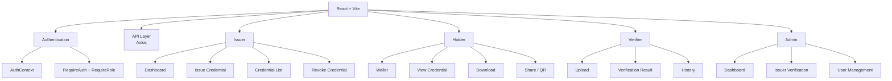
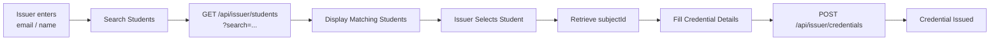

# SSD-CVE — Section 7: Frontend Design (React)

## Structure

```
React + Vite
├── Authentication (AuthContext, RequireAuth, RequireRole)
├── API Layer (Axios client, Auth/Issuer/Holder/Verifier APIs)
├── Issuer (Dashboard, Issue Credential, Credential List, Revoke)
├── Holder (Wallet, Credential View, Download, Share/QR)
├── Verifier (Upload, Verification Result, History)
└── Admin (Dashboard, Issuer Verification, User Management)
```



## Routing

```jsx
<Routes>
  <Route path="/login" element={<LoginPage />} />
  <Route path="/register" element={<RegisterPage />} />
  <Route path="/issuer" element={
    <RequireAuth><RequireRole role="ISSUER"><IssuerDashboard /></RequireRole></RequireAuth>
  } />
  <Route path="/holder" element={
    <RequireAuth><RequireRole role="HOLDER"><HolderWallet /></RequireRole></RequireAuth>
  } />
  <Route path="/verifier" element={
    <RequireAuth><RequireRole role="VERIFIER"><VerifierPortal /></RequireRole></RequireAuth>
  } />
  <Route path="/admin" element={
    <RequireAuth><RequireRole role="ADMIN"><AdminDashboard /></RequireRole></RequireAuth>
  } />
  <Route path="/" element={<HomePage />} />
</Routes>
```

## Auth Flow

- **Access token:** short-lived, held in memory
- **Refresh token:** HttpOnly + Secure + SameSite cookie (never localStorage)
- Client-side role = UI routing only; backend is authoritative

```
Login → POST /api/auth/login → access token + refresh cookie
  → Axios interceptor adds Bearer token
  → on 401, try refresh → on refresh fail, redirect to /login
```

## Key UX Decisions

### Issuer Form — search student, not UUID
```
Issuer enters email/name
  ↓
GET /api/issuer/students?search=...
  ↓
Select student
  ↓
Frontend gets subjectId
  ↓
POST /api/issuer/credentials
```

### Issuer Form Diagram



### Verifier Result Card — three-check security story
```
┌──────────────────────────────────────────────┐
│             ✓ CREDENTIAL VALID               │
├──────────────────────────────────────────────┤
│ Credential                                   │
│ SSD-CVE-2026-8F42A1                           │
│                                              │
│ Type                                         │
│ Degree Certificate                           │
│                                              │
│ Issuer                                       │
│ Example University ✓ Verified                 │
│                                              │
│ Integrity                                    │
│ ✓ SHA-256 hash verified                      │
│                                              │
│ Authenticity                                 │
│ ✓ Ed25519 signature verified                 │
│                                              │
│ Registry                                     │
│ ✓ Credential registered                      │
│                                              │
│ Status                                       │
│ ✓ ACTIVE                                     │
│                                              │
│ Verified                                     │
│ 04 Sep 2026, 12:00 UTC                       │
└──────────────────────────────────────────────┘
```

### Holder Share — QR code
- QR contains only `credentialNumber` (no private data)
- Verifier scans → verification API → result

## Tech Choices

| Concern | Technology |
|---------|-----------|
| Build | Vite |
| Framework | React |
| HTTP | Axios |
| Routing | React Router |
| State | React Context + useReducer |
| Forms | React Hook Form |
| Validation | Zod |
| Styling | Tailwind CSS |
| Icons | Lucide React |
| QR | Client-side QR library |
| File handling | Native File API + FormData |
| Notifications | Custom Toast |

No Redux, Next.js, or Firebase needed — keeps the frontend lightweight and ₹0.
