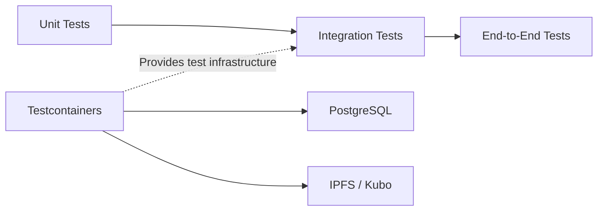
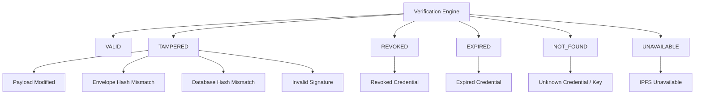
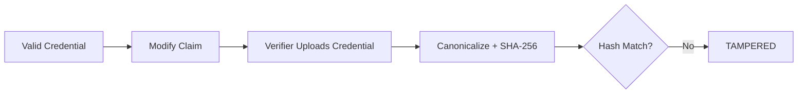
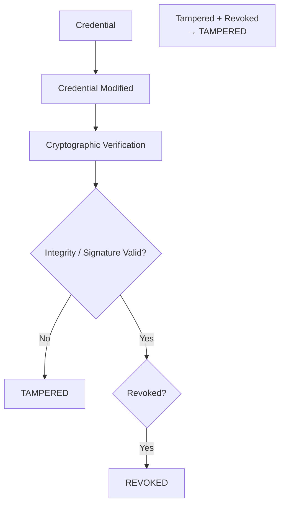

# SSD-CVE — Section 9: Testing & Validation

## Testing Strategy



**Testcontainers** is the infrastructure mechanism (PostgreSQL + IPFS/Kubo) supporting integration/E2E tests — not a separate layer.

| Layer | Purpose |
|-------|---------|
| Unit | Individual services/components in isolation |
| Integration | Spring Boot + PostgreSQL + IPFS interactions |
| E2E | Complete user workflow through React → API → DB/IPFS |

## Critical Test Cases

### CanonicalizationService
- Same data, different key order → same hash
- Same data, different whitespace → same hash
- UTF-8 encoding correctness
- `null` values preserved consistently
- Timestamp representation is deterministic
- Nested object key ordering is deterministic
- Array ordering is preserved

### CryptoService
- Sign → verify roundtrip succeeds
- Tampered content → verification fails
- Wrong public key → verification fails
- Invalid signature encoding → rejected
- Empty/invalid payload → rejected
- Signature algorithm mismatch → rejected
- Generated Ed25519 key pair works with PKCS12 KeyStore

### VerificationService — all three hash comparisons
- Recomputed hash != envelope hash → TAMPERED
- Recomputed hash != DB hash → TAMPERED
- Envelope hash != DB hash → TAMPERED
- Invalid Ed25519 signature → TAMPERED
- Unknown keyId → NOT_FOUND / invalid credential

### IssuerService
- Only verified issuers can issue
- Issuer can only revoke own credentials
- Credential number uniqueness
- Private key never exposed through API
- Credential contains correct issuer identity
- Credential contains correct keyId
- Signature generated with active issuer key
- Revocation is idempotent / already revoked handled correctly
- **Ownership:** Issuer A revoking Issuer B's credential → FORBIDDEN (not trusting URL `{id}`)

### AuthService
- Login success/failure
- Refresh token rotation
- Role-based access enforcement
- Expired access token → rejected
- Expired refresh token → rejected
- Revoked refresh token → rejected
- Reused refresh token → rejected
- Invalid refresh token → rejected
- Wrong role → FORBIDDEN
- Unauthenticated request → UNAUTHORIZED
- Refresh token in HttpOnly + Secure + SameSite cookie (not localStorage)

## Core Verification Suite



```
verify_validCredential_returnsValid()
verify_tamperedPayload_returnsTampered()
verify_tamperedHash_returnsTampered()
verify_invalidSignature_returnsTampered()
verify_databaseHashMismatch_returnsTampered()
verify_revokedCredential_returnsRevoked()
verify_expiredCredential_returnsExpired()
verify_unknownCredential_returnsNotFound()
verify_ipfsUnavailable_returnsUnavailable()
verify_unknownKeyId_returnsNotFoundOrInvalid()
verify_revokedAndTamperedCredential_returnsTampered()   // TAMPERED, not REVOKED
verify_expiredAndTamperedCredential_returnsTampered()   // TAMPERED, not EXPIRED
```

**Invariant:** Cryptographic integrity/authenticity must be established **before** trusting credential status or expiry.

## Security Tests

### Authentication
- Missing JWT → 401
- Invalid JWT → 401
- Expired JWT → 401

### Authorization / RBAC
- HOLDER accessing `/api/issuer/**` → 403
- VERIFIER accessing `/api/admin/**` → 403
- ISSUER accessing another issuer's credential → 403

### Input Validation
- Missing required fields → 400
- Invalid UUID → 400
- Invalid credential JSON → 400
- Oversized upload → 400/413

### File Security
- Wrong MIME type rejected
- Malformed JSON rejected
- Missing signature rejected
- Missing contentHash rejected
- Invalid Base64 signature rejected

### Sensitive Data Protection
- Password never returned in API response
- Private key never returned
- Unnecessary PII not returned

## End-to-End Validation

```mermaid
flowchart LR

    A["Issue Credential"]
    --> B["Credential Created"]

    B --> C["Store in IPFS"]

    C --> D["CID Generated"]

    D --> E["Store Metadata in PostgreSQL"]

    E --> F["Holder Receives Credential"]

    F --> G["Verifier Uploads Credential"]

    G --> H["Verification → VALID"]

    H --> I["Issuer Revokes Credential"]

    I --> J["Verifier Checks Again"]

    J --> K["Verification → REVOKED"]
```




```
Issue → Credential created → IPFS CID generated → DB record created
  → Holder receives credential
  → Verification → VALID
  → Issuer revokes
  → Verification again → REVOKED
```

Tampering branch:



```
Issue → Modify claim → Verify → TAMPERED
```

Revoke branch:



## Milestone Validation Checklist

- [ ] All unit tests pass
- [ ] Integration tests pass (Testcontainers)
- [ ] E2E: issue → store → share → verify → revoke → verify
- [ ] Security: JWT expiry, RBAC, ownership checks
- [ ] ₹0 cost maintained
